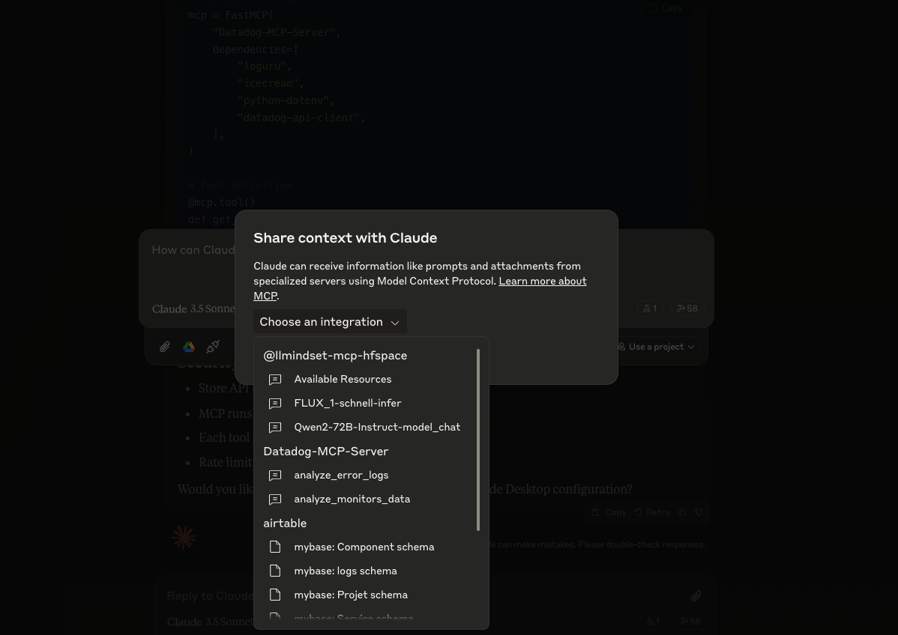
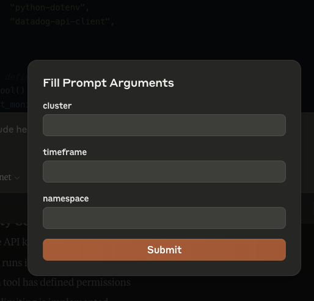
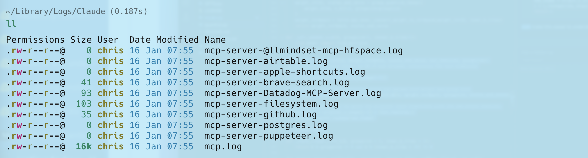

# Datadog Model Context Protocol (MCP) 🔍

A Python-based tool to interact with Datadog API and fetch monitoring data from your infrastructure. This MCP provides easy access to monitor states and Kubernetes logs through a simple interface.

## Datadog Features 🌟

- **Monitor State Tracking**: Fetch and analyze specific monitor states
- **Kubernetes Log Analysis**: Extract and format error logs from Kubernetes clusters

## Prerequisites 📋

- Python 3.11+
- Datadog API and Application keys (with correct permissions)
- Access to Datadog site

## Installation 🔧

```bash
pip install -r requirements.txt
```

Required packages:

```text
datadog-api-client
fastmcp
loguru
icecream
python-dotenv
uv
```

## Environment Setup 🔑

Create a `.env` file with your Datadog credentials:

```env
DD_API_KEY=your_api_key
DD_APP_KEY=your_app_key
```

## Setup Claude Desktop Setup for MCP 🖥️

1. Install Claude Desktop

```bash
# Assuming you're on macOS
brew install claude-desktop

# Or download from official website
https://claude.ai/desktop
```

2. Set up Datadog MCP config:

```bash
# on mac is 
~/Library/Application\ Support/Claude/claude_desktop_config.json


# Add this to your claude config json
```json
    "Datadog-MCP-Server": {
      "command": "uv",
      "args": [
        "run",
        "--with",
        "datadog-api-client",
        "--with",
        "fastmcp",
        "--with",
        "icecream",
        "--with",
        "loguru",
        "--with",
        "python-dotenv",
        "fastmcp",
        "run",
        "/your-path/mcp-collection/datadog/main.py"
      ],
      "env": {
        "DD_API_KEY": "xxxx",
        "DD_APP_KEY": "xxx"
      }
    },
```

## Usage 💻

<video src="assets/monitor.webm" controls="controls" muted="muted" style="max-width:720px;">

</video>
<video src="assets/logs.webm" controls="controls" muted="muted" style="max-width:720px;">

</video>
## Architecture 🏗

- **FastMCP Base**: Utilizes FastMCP framework for tool management
- **Modular Design**: Separate functions for monitors and logs
- **Type Safety**: Full typing support with Python type hints
- **API Abstraction**: Wrapped Datadog API calls with error handling

I'll add a section about MCP and Claude Desktop setup:

# Model Context Protocol (MCP) Introduction 🤖

## What is MCP?

Model Context Protocol (MCP) is a framework allowing AI models to interact with external tools and APIs in a standardized way. It enables models like Claude to:

- Access external data
- Execute commands
- Interact with APIs
- Maintain context across conversations

## some examples of MCP servers

<https://github.com/punkpeye/awesome-mcp-servers?tab=readme-ov-file>

## Tutorial for setup MCP

<https://medium.com/@pedro.aquino.se/how-to-use-mcp-tools-on-claude-desktop-app-and-automate-your-daily-tasks-1c38e22bc4b0>

## How it works - Available Functions 🛠️

the LLM use provided function to get the data and use it

### 1. Get Monitor States

```python
get_monitor_states(
    name: str,           # Monitor name to search
    timeframe: int = 1   # Hours to look back
)
```

Example:

```python

response = get_monitor_states(name="traefik")

# Sample Output
{
    "id": "12345678",
    "name": "traefik",
    "status": "OK",
    "query": "avg(last_5m):avg:traefik.response_time{*} > 1000",
    "message": "Response time is too high",
    "type": "metric alert",
    "created": "2024-01-14T10:00:00Z",
    "modified": "2024-01-14T15:30:00Z"
}
```

### 2. Get Kubernetes Logs

```python
get_k8s_logs(
    cluster: str,            # Kubernetes cluster name
    timeframe: int = 5,      # Hours to look back
    namespace: str = None    # Optional namespace filter
)
```

Example:

```python
logs = get_k8s_logs(
    cluster="prod-cluster",
    timeframe=3,
    namespace="default"
)

# Sample Output
{
    "timestamp": "2024-01-14T22:00:00Z",
    "host": "worker-1",
    "service": "nginx-ingress",
    "pod_name": "nginx-ingress-controller-abc123",
    "namespace": "default",
    "container_name": "controller",
    "message": "Connection refused",
    "status": "error"
}
```

```bash
# Install as MCP extension
cd datadog
task install-mcp
```

## 4. Verify Installation

### In Claude chat desktop

 check datadog connection in claude



 you will see that


## 5. Use Datadog MCP Tools

## Security Considerations 🔒

- Store API keys in `.env`
- MCP runs in isolated environment
- Each tool has defined permissions
- Rate limiting is implemented

## Troubleshooting 🔧

### Using MCP Inspector

```bash
# Launch MCP Inspector for debugging
task run-mcp-inspector
```

The MCP Inspector provides:

- Real-time view of MCP server status
- Function call logs
- Error tracing
- API response monitoring

### Common issues and solutions

1. **API Authentication Errors**

   ```bash
   Error: (403) Forbidden
   ```

   ➡️ Check your DD_API_KEY and DD_APP_KEY in .env

2. **MCP Connection Issues**

   ```bash
   Error: Failed to connect to MCP server
   ```

   ➡️ Verify your claude_desktop_config.json path and content

3. **Monitor Not Found**

   ```bash
   Error: No monitor found with name 'xxx'
   ```

   ➡️ Check monitor name spelling and case sensitivity

4. **logs can be found here**



## Contributing 🤝

Feel free to:

1. Open issues for bugs
2. Submit PRs for improvements
3. Add new features

## Notes 📝

- API calls are made to Datadog EU site
- Default timeframe is 1 hour for monitor states
- Page size limits are set to handle most use cases

## License 📜

 This project is licensed under the MIT License. See the [LICENSE](LICENSE) file for details.
